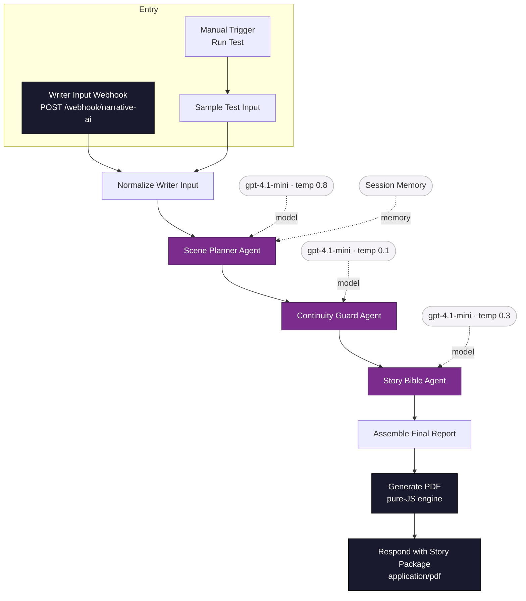
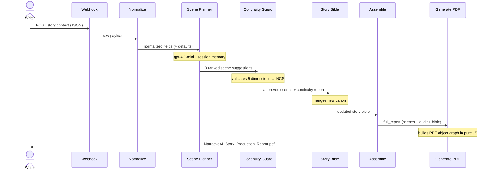

# NarrativeAI — Story Co-Writer Agent

<p align="center">
  
  
</p>

<p align="center">
  
  
  
  
  
  
  
</p>

An agentic, multi-LLM **story production pipeline** built on n8n. A single request runs three specialised AI agents in sequence — **Scene Planning → Continuity Validation → Story-Bible canonisation** — and returns a finished, formatted **PDF report** generated entirely inside the workflow. No external PDF service. No API keys beyond the LLM. Zero npm dependencies.

---

## Working output

> The pipeline's actual end-to-end result — three ranked scenes, a continuity audit with a Narrative Coherence Score, and an updated story bible — rendered to PDF *inside* n8n and returned over the webhook.


---

## Architecture



## Request lifecycle



## The three agents

| Agent | Role | Output |
|-------|------|--------|
| **Scene Planner** | Senior story co-writer | 3 ranked scenes — summary, narrative purpose, character impact, threads, opening line |
| **Continuity Guard** | Narrative QA | Per-scene PASS / WARN / FAIL across character, timeline, location, relationships and constraints, plus an overall **Narrative Coherence Score (NCS)** and APPROVE / REVISE / REJECT |
| **Story Bible Agent** | Canon keeper | Complete updated Story Bible — characters, world state, event history, lore, locked elements, change log |

## Why a custom PDF generator

n8n Cloud's Code node cannot import npm packages (pdfkit, jspdf, etc.). [`src/generate-pdf.js`](src/generate-pdf.js) therefore implements a **self-contained PDF writer in pure JavaScript**: it hand-builds the PDF object graph (catalog, pages, Helvetica / Helvetica-Bold fonts, content streams, xref table) with automatic text wrapping, pagination, and lightweight Markdown styling. No dependencies, no API keys, runs anywhere n8n runs.

## Run it

### Option A — In the n8n editor
1. Import [`workflow/narrativeai-workflow.json`](workflow/narrativeai-workflow.json).
2. Attach an OpenAI credential to the three LLM nodes (the bundled n8n AI credits allow `gpt-4.1-mini`).
3. Click **Execute Workflow** — the `Run Test` trigger feeds the sample noir-thriller case through the whole pipeline.
4. Open the **Generate PDF** (or **Respond**) node and download the produced PDF.

### Option B — Live webhook
```bash
curl -X POST https://<your-n8n-host>/webhook/narrative-ai \
  -H "Content-Type: application/json" \
  -d @examples/sample-request.json \
  --output NarrativeAI_Story_Production_Report.pdf
```

## Input fields

| Field | Description |
|-------|-------------|
| `content` | The current narrative beat / writer input |
| `storyBibleContext` | Existing canon (characters, world, prior events) |
| `genre`, `tone`, `pacing` | Stylistic controls |
| `constraints` | Hard rules the scenes must honour |
| `sessionId` | Conversation key for session memory |

## Repository layout

```
.
├── workflow/narrativeai-workflow.json   # Importable n8n workflow (15 nodes)
├── src/generate-pdf.js                  # Pure-JS PDF generator (Code node source)
├── examples/sample-request.json         # Example webhook payload
├── docs/
│   ├── NarrativeAI_Source_Code.pdf      # Full source as a PDF
│   └── sample-output.png                # Working output screenshot
├── LICENSE
└── README.md
```

## Tech stack

`n8n` · LangChain agent nodes · OpenAI `gpt-4.1-mini` · session memory · Narrative Coherence Scoring · pure-JavaScript PDF rendering.

---

<p align="center"><em>Built for the Capgemini Excellencer AgentifAI Buildathon.</em></p>
