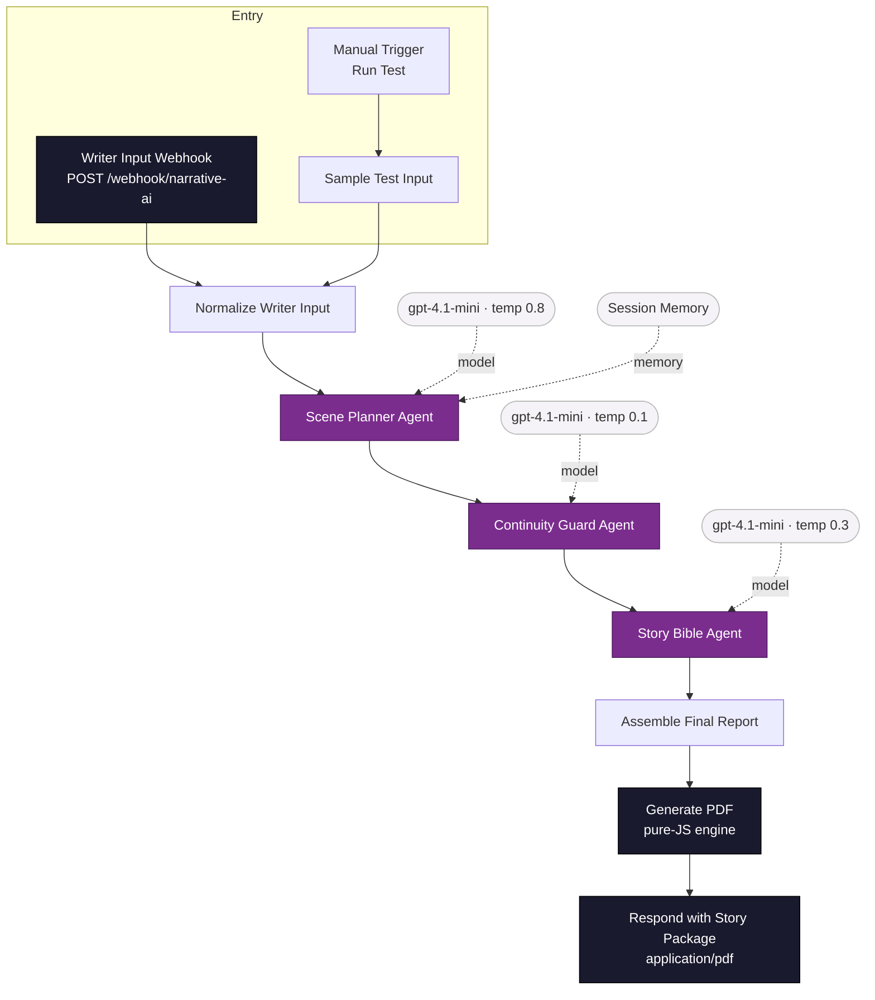
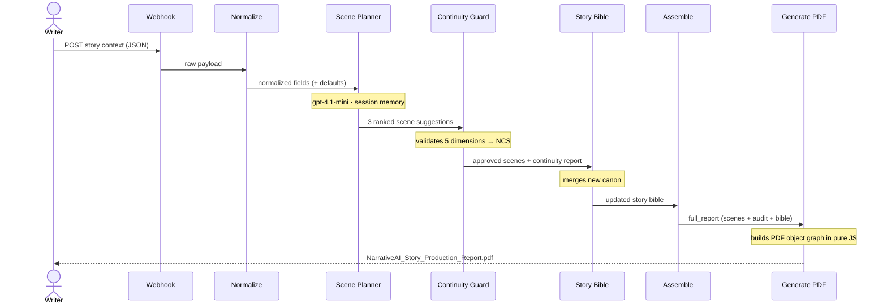

# NarrativeAI — Story Co-Writer Agent

<p align="center">
  
  
  
</p>

<p align="center">
  
  
  
</p>

<p align="center">
  
  
  
  
</p>

An agentic, multi-LLM **story production pipeline** built on n8n. A single request runs three specialised AI agents in sequence — **Scene Planning → Continuity Validation → Story-Bible canonisation** — and returns a finished, formatted **PDF report** generated entirely inside the workflow. No external PDF service. No API keys beyond the LLM. Zero npm dependencies.

---

## Working output

> The pipeline's actual end-to-end result — three ranked scenes, a continuity audit with a Narrative Coherence Score, and an updated story bible — rendered to PDF *inside* n8n and returned over the webhook.

<p align="center">
  
</p>
---

## Architecture



## Request lifecycle



## The three agents

| Agent | Role | Output |
|-------|------|--------|
| **Scene Planner** | Senior story co-writer | 3 ranked scenes — summary, narrative purpose, character impact, threads, opening line |
| **Continuity Guard** | Narrative QA | Per-scene PASS / WARN / FAIL across character, timeline, location, relationships and constraints, plus an overall **Narrative Coherence Score (NCS)** and APPROVE / REVISE / REJECT |
| **Story Bible Agent** | Canon keeper | Complete updated Story Bible — characters, world state, event history, lore, locked elements, change log |

## Why a Custom PDF Engine?

Instead of relying on external PDF libraries, NarrativeAI uses a **fully self-contained PDF generation engine written in pure JavaScript**. This design choice was driven by the execution constraints of **n8n Cloud**, where Code nodes cannot install or import npm packages such as PDFKit or jsPDF.

The custom engine located in `src/generate-pdf.js` directly constructs the PDF document structure—including catalogs, pages, fonts, content streams, cross-reference tables, and metadata—without any third-party dependencies. It also provides:

- Automatic text wrapping and pagination
- Markdown-aware formatting
- Dynamic chapter and section rendering
- Consistent typography and document layout
- Lightweight, portable execution across all n8n environments

The result is a **dependency-free, cloud-native PDF generation pipeline** that requires no additional services, API keys, or runtime installations while producing professional, production-ready reports.

---

## Running the Workflow

### Option A — Execute from the n8n Editor

1. Import `workflow/narrativeai-workflow.json` into your n8n workspace.
2. Configure OpenAI credentials for the three LLM nodes.
3. Execute the workflow using the built-in **Run Test** trigger.
4. The sample narrative is processed through the complete multi-agent pipeline:
   - Story Analysis Agent
   - Narrative Enhancement Agent
   - Production Report Agent
5. Open the **Generate PDF** or **Respond** node to download the generated report.

---

### Option B — Invoke via Webhook

Trigger the entire workflow programmatically using the exposed webhook endpoint:

```bash
curl -X POST https://<your-n8n-host>/webhook/narrative-ai \
  -H "Content-Type: application/json" \
  -d @examples/sample-request.json \
  --output NarrativeAI_Story_Production_Report.pdf
```

The workflow automatically:

1. Receives the story payload.
2. Executes the multi-agent processing pipeline.
3. Generates a structured production report.
4. Returns a downloadable PDF document as the final output.

---

## Workflow Overview

```text
Input Story
     │
     ▼
┌───────────────────────┐
│ Story Analysis Agent  │
└──────────┬────────────┘
           │
           ▼
┌───────────────────────┐
│ Narrative Enhancement │
│        Agent          │
└──────────┬────────────┘
           │
           ▼
┌───────────────────────┐
│ Production Report     │
│        Agent          │
└──────────┬────────────┘
           │
           ▼
┌───────────────────────┐
│ Custom PDF Generator  │
└──────────┬────────────┘
           │
           ▼
    Final PDF Report
```

---

## Key Advantages

| Feature | Benefit |
|----------|----------|
| Zero Dependencies | No external PDF libraries required |
| Cloud-Native | Runs directly inside n8n Cloud |
| Portable | Works across local, cloud, and self-hosted deployments |
| Lightweight | Minimal runtime overhead |
| Fully Automated | End-to-end story-to-report generation |
| Production Ready | Generates stakeholder-friendly PDF reports |
| Cost Efficient | No additional PDF generation service required |
| Self-Contained | Entire workflow runs within a single automation pipeline |

---

## Technical Highlights

- **Pure JavaScript PDF Engine**
  - No PDFKit
  - No jsPDF
  - No external rendering services

- **Agentic AI Workflow**
  - Multi-agent sequential orchestration
  - Context preservation between stages
  - Structured output generation

- **n8n Native Architecture**
  - Built entirely using n8n workflows
  - Compatible with n8n Cloud and self-hosted deployments
  - Easy integration with external APIs and enterprise systems

- **Scalable Design**
  - Supports long-form narratives
  - Handles multi-chapter story analysis
  - Generates production-ready documentation

---

## Design Philosophy

NarrativeAI was designed around three core principles:

1. **Simplicity** — Minimize operational complexity by avoiding external dependencies.
2. **Portability** — Ensure the workflow can run anywhere n8n runs.
3. **Reliability** — Produce consistent, professional-quality reports without requiring additional infrastructure.

By combining a multi-agent AI pipeline with a custom-built PDF generation engine, NarrativeAI delivers a complete **Story-to-Report Automation System** capable of transforming raw narrative content into structured, stakeholder-ready documentation with minimal operational overhead.
## Input fields

| Field | Description |
|-------|-------------|
| `content` | The current narrative beat / writer input |
| `storyBibleContext` | Existing canon (characters, world, prior events) |
| `genre`, `tone`, `pacing` | Stylistic controls |
| `constraints` | Hard rules the scenes must honour |
| `sessionId` | Conversation key for session memory |

## Repository layout

```
.
├── workflow/narrativeai-workflow.json   # Importable n8n workflow (15 nodes)
├── src/generate-pdf.js                  # Pure-JS PDF generator (Code node source)
├── examples/sample-request.json         # Example webhook payload
├── docs/
│   ├── NarrativeAI_Source_Code.pdf      # Full source as a PDF
│   └── sample-output.png                # Working output screenshot
├── LICENSE
└── README.md
```

## Tech stack

`n8n` · LangChain agent nodes · OpenAI `gpt-4.1-mini` · session memory · Narrative Coherence Scoring · pure-JavaScript PDF rendering.

---

<p align="center"><em>Built for the Capgemini Excellencer AgentifAI Buildathon.</em></p>
